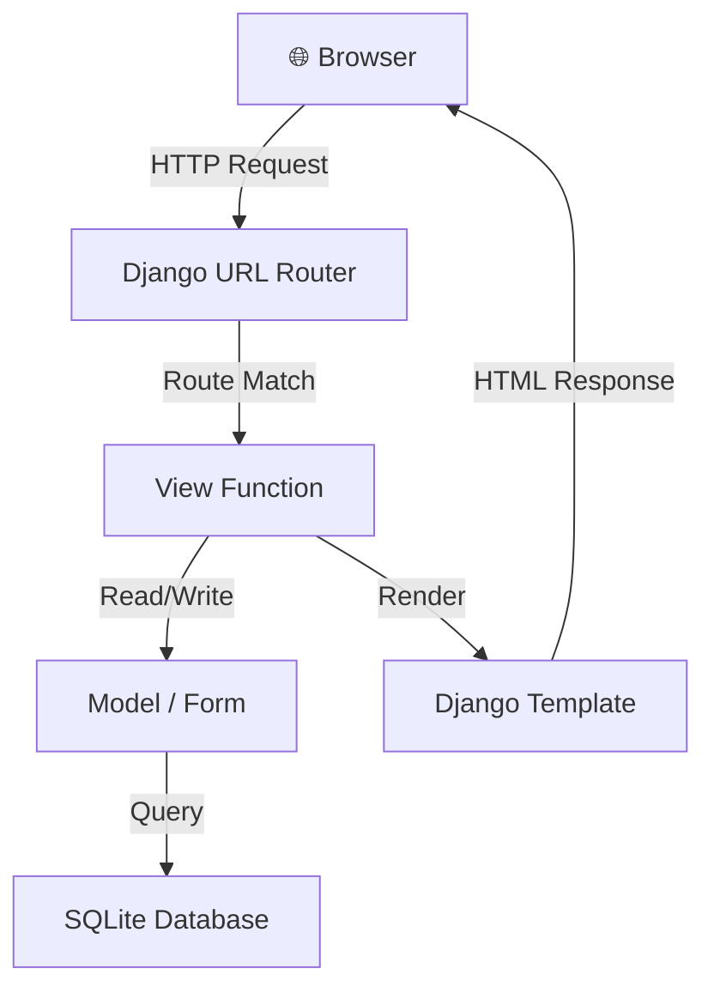
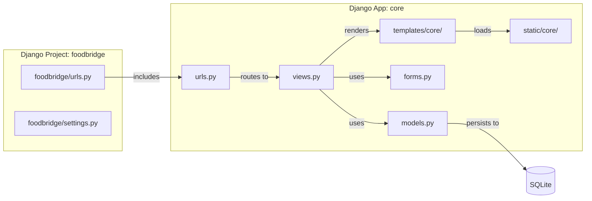
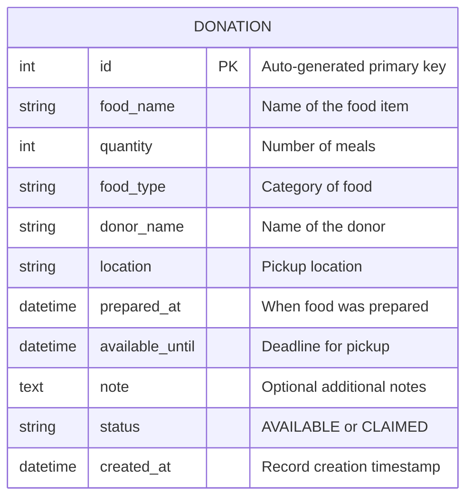
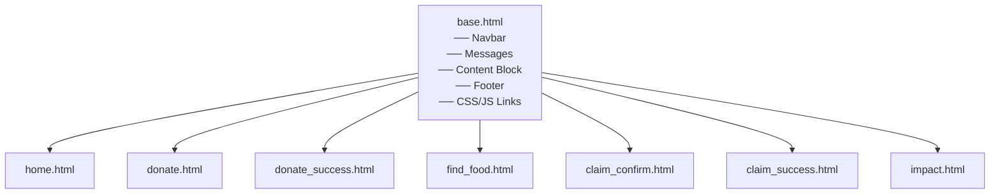
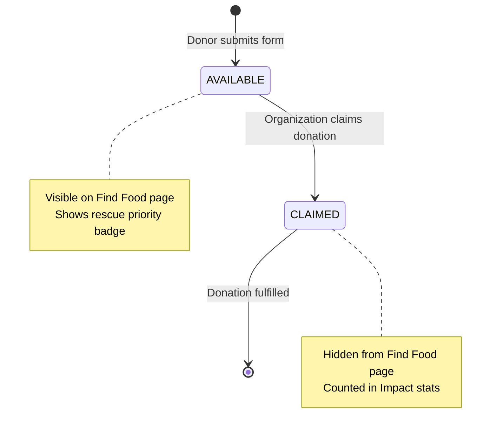
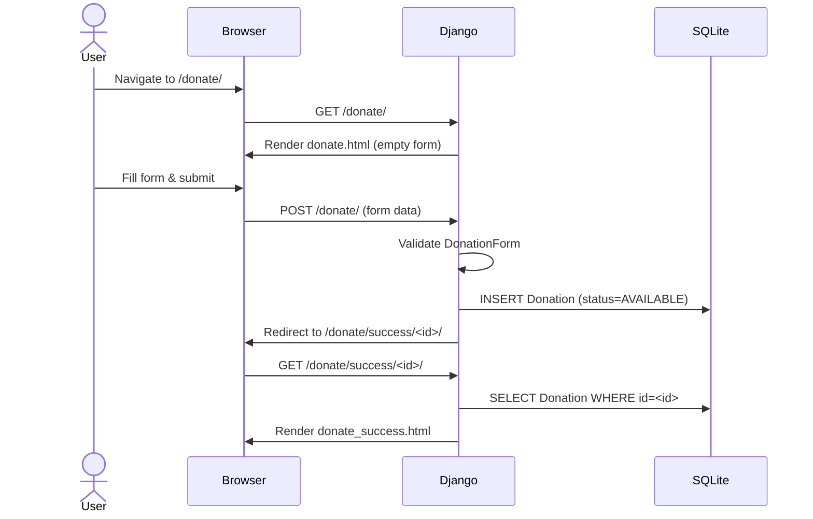
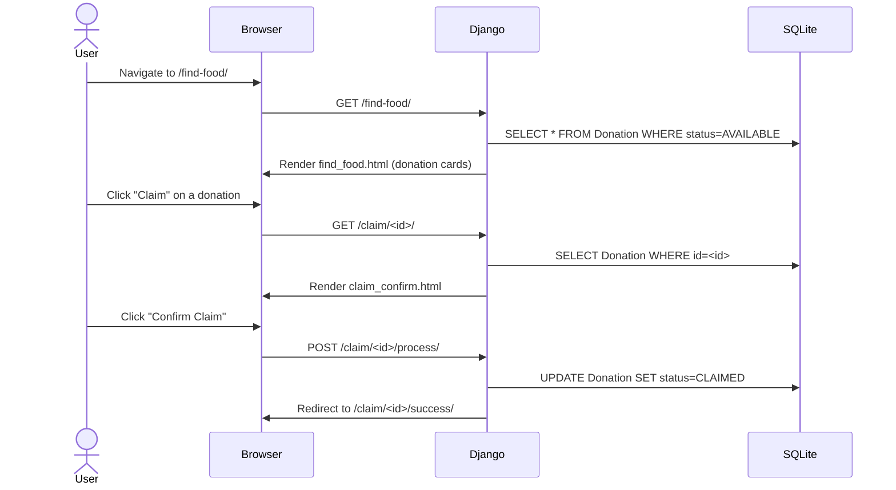

# FoodBridge — Architecture Document

## System Overview

FoodBridge uses a standard **Django MVT (Model-View-Template)** architecture with SQLite as the database. The entire application runs as a single Django project with one custom app (`core`).

### Request Flow



### High-Level Architecture



---

## Directory Structure

```
d:\proj_vibe\
│
├── docs/                          # Project documentation
│   ├── requirements.md
│   ├── architecture.md
│   ├── plan.md
│   └── todo.md
│
├── manage.py                      # Django management script
│
├── foodbridge/                    # Django project configuration
│   ├── __init__.py
│   ├── settings.py                # Project settings
│   ├── urls.py                    # Root URL configuration
│   ├── asgi.py
│   └── wsgi.py
│
├── core/                          # Main application
│   ├── __init__.py
│   ├── admin.py                   # Admin site registration
│   ├── apps.py                    # App configuration
│   ├── forms.py                   # DonationForm
│   ├── models.py                  # Donation model
│   ├── urls.py                    # App URL patterns
│   ├── views.py                   # View functions
│   ├── management/
│   │   └── commands/
│   │       └── seed_data.py       # Sample data loader
│   │
│   ├── migrations/                # Database migrations
│   │   └── __init__.py
│   │
│   ├── templates/
│   │   └── core/
│   │       ├── base.html          # Base template (navbar, footer, meta)
│   │       ├── home.html          # Home / landing page
│   │       ├── donate.html        # Donation form page
│   │       ├── donate_success.html # Donation confirmation
│   │       ├── find_food.html     # Available donations listing
│   │       ├── claim_confirm.html # Claim confirmation page
│   │       ├── claim_success.html # Claim success page
│   │       └── impact.html        # Impact statistics page
│   │
│   └── static/
│       └── core/
│           ├── css/
│           │   └── style.css      # All project styles
│           └── js/
│               └── main.js        # Minimal JS (animations, interactions)
│
├── db.sqlite3                     # SQLite database (auto-generated)
├── venv/                          # Python virtual environment
├── .gitignore
└── .git/
```

### Design Decisions

| Decision | Rationale |
|---|---|
| **Single app (`core`)** | The project is small enough that one app keeps things simple. No need for `users`, `donations`, `impact` as separate apps. |
| **No `templatetags/`** | Priority badges and formatting will be handled in views by annotating the queryset. Avoids adding complexity. |
| **Separate success pages** | Instead of just flash messages, dedicated success pages give a cleaner demo flow and clearer user feedback. |
| **Management command for seed data** | `python manage.py seed_data` is the Django-standard way to load sample data. Cleaner than fixtures or ad-hoc scripts. |

---

## Django Apps

### `foodbridge` (Project)
The Django project configuration. Contains settings, root URL config, and WSGI/ASGI entry points.

### `core` (App)
The single application containing all business logic, models, forms, views, and templates.

---

## Database Model

### `Donation`



#### Field Details

| Field | Type | Constraints | Description |
|---|---|---|---|
| `id` | AutoField | PK, auto | Primary key |
| `food_name` | CharField | max_length=200, required | Name of the food |
| `quantity` | PositiveIntegerField | required | Number of meals available |
| `food_type` | CharField | max_length=50, choices, required | Category (Prepared Meals, Baked Goods, etc.) |
| `donor_name` | CharField | max_length=200, required | Who is donating |
| `location` | CharField | max_length=300, required | Pickup location description |
| `prepared_at` | DateTimeField | required | When the food was prepared |
| `available_until` | DateTimeField | required | Deadline — food available until this time |
| `note` | TextField | blank=True | Optional notes from donor |
| `status` | CharField | max_length=20, choices, default='AVAILABLE' | Donation lifecycle status |
| `created_at` | DateTimeField | auto_now_add=True | When the record was created |

#### Status Choices

```python
STATUS_CHOICES = [
    ('AVAILABLE', 'Available'),
    ('CLAIMED', 'Claimed'),
]
```

#### Food Type Choices

```python
FOOD_TYPE_CHOICES = [
    ('prepared', 'Prepared Meals'),
    ('baked', 'Baked Goods'),
    ('produce', 'Fresh Produce'),
    ('packaged', 'Packaged Food'),
    ('beverages', 'Beverages'),
    ('other', 'Other'),
]
```

---

## Views

All views are **function-based views** (FBVs) for simplicity.

| View | URL | Method(s) | Description |
|---|---|---|---|
| `home` | `/` | GET | Landing page with hero, stats, how-it-works, featured donations |
| `donate` | `/donate/` | GET, POST | Donation form — GET shows form, POST creates donation |
| `donate_success` | `/donate/success/<id>/` | GET | Confirmation after successful donation |
| `find_food` | `/find-food/` | GET | Lists all available donations with priority badges |
| `claim_confirm` | `/claim/<id>/` | GET | Shows donation details and confirm-claim button |
| `claim_process` | `/claim/<id>/process/` | POST | Processes the claim, updates status to CLAIMED |
| `claim_success` | `/claim/<id>/success/` | GET | Success page after claiming |
| `impact` | `/impact/` | GET | Impact statistics page |

---

## Forms

### `DonationForm`

A `ModelForm` for the `Donation` model.

- **Includes:** `food_name`, `quantity`, `food_type`, `donor_name`, `location`, `prepared_at`, `available_until`, `note`
- **Excludes:** `status`, `created_at` (auto-managed)
- **Widgets:** Custom datetime widgets for `prepared_at` and `available_until` fields (HTML5 `datetime-local` input type)

---

## URL Structure

```
/                           →  home
/donate/                    →  donate (form)
/donate/success/<id>/       →  donate_success
/find-food/                 →  find_food
/claim/<id>/                →  claim_confirm
/claim/<id>/process/        →  claim_process (POST only)
/claim/<id>/success/        →  claim_success
/impact/                    →  impact
```

### URL Configuration

```
foodbridge/urls.py
    └── includes → core/urls.py (at root "")
```

---

## Template Hierarchy



### `base.html` Provides
- HTML5 doctype and meta tags
- Google Fonts link (Inter)
- Static CSS link
- Responsive navbar with logo and navigation links
- Django messages framework integration (success/error alerts)
- `` for page-specific content
- Footer with branding
- Static JS link

---

## Rescue Priority Logic

Implemented as a **method on the Donation model** or computed in the view:

```python
from django.utils import timezone

def get_rescue_priority(donation):
    now = timezone.now()
    remaining = donation.available_until - now

    if remaining.total_seconds() <= 0:
        return {'label': 'Expired', 'class': 'expired', 'icon': '⚫'}
    elif remaining.total_seconds() <= 3600:        # ≤ 1 hour
        return {'label': 'High Priority', 'class': 'high', 'icon': '🔥'}
    elif remaining.total_seconds() <= 10800:       # ≤ 3 hours
        return {'label': 'Medium Priority', 'class': 'medium', 'icon': '🟠'}
    else:                                          # > 3 hours
        return {'label': 'Normal', 'class': 'normal', 'icon': '🟢'}
```

This keeps priority calculation in pure Python — no AI, no external APIs.

---

## Donation Lifecycle



---

## Request Flow Examples

### Donating Food



### Claiming Food



---

## Static Files & Styling

### CSS Architecture (`style.css`)

The single CSS file is organized in sections:

1. **CSS Variables** — Color palette, spacing, typography tokens
2. **Reset / Base** — Normalize defaults, body styles
3. **Typography** — Headings, paragraphs, links
4. **Layout** — Container, grid, flex utilities
5. **Navbar** — Fixed top navigation
6. **Hero** — Landing page hero section
7. **Cards** — Donation cards, stat cards
8. **Forms** — Input styling, buttons
9. **Badges** — Priority badges (high, medium, normal)
10. **Footer** — Site footer
11. **Animations** — Subtle fade-in, hover effects
12. **Responsive** — Media queries for tablet and mobile

### Color Palette

| Token | Value | Usage |
|---|---|---|
| `--primary` | `#1B5E20` | Deep green — primary brand color |
| `--primary-light` | `#4CAF50` | Fresh green — buttons, accents |
| `--primary-lighter` | `#E8F5E9` | Light green — backgrounds, tints |
| `--accent` | `#FF6D00` | Orange — urgency indicators, CTAs |
| `--bg` | `#FFFFFF` | White — main backgrounds |
| `--bg-off` | `#F5F7F5` | Off-white — section backgrounds |
| `--text` | `#212121` | Dark charcoal — body text |
| `--text-light` | `#616161` | Medium gray — secondary text |
| `--border` | `#E0E0E0` | Light gray — borders, dividers |

### JavaScript (`main.js`)

Minimal vanilla JS for:

- Scroll-triggered fade-in animations on the home page
- Mobile nav toggle (hamburger menu)
- Smooth scroll for anchor links
- Auto-dismiss flash messages after a few seconds

No frameworks. No libraries. No external dependencies.

---

## Settings Configuration

Key settings to configure in `foodbridge/settings.py`:

```python
INSTALLED_APPS = [
    'django.contrib.admin',
    'django.contrib.auth',
    'django.contrib.contenttypes',
    'django.contrib.sessions',
    'django.contrib.messages',
    'django.contrib.staticfiles',
    'core',  # Our app
]

TEMPLATES = [{
    'DIRS': [],  # Using app-level templates
    ...
}]

STATIC_URL = '/static/'

# Use Django messages framework for flash messages
MESSAGE_STORAGE = 'django.contrib.messages.storage.session.SessionStorage'
```

No additional third-party packages required beyond Django.
