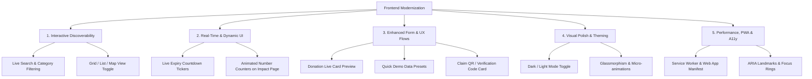

# FoodBridge — Frontend Improvements & Implementation Guide

> **Document Version:** 1.1  
> **Status:** Active & Implemented (Quick Refinements Completed)  
> **Scope:** UI/UX, Component Architecture, Interactive Features, Theme System & Client Performance  

---

## 1. Current Frontend Audit & Analysis

A comprehensive analysis of the existing codebase (`core/templates/core/`, `static/core/css/style.css`, and `static/core/js/main.js`) reveals a clean, functional MVP foundation with significant opportunities for modernization.

### Strengths in Current Codebase
- **Clean Semantic Structure:** Proper HTML5 landmark tags (`<nav>`, `<main>`, `<section>`, `<footer>`).
- **CSS Custom Properties:** Centralized color variables (`--primary`, `--accent`, `--bg-light`, etc.).
- **Lightweight Vanilla JS:** Zero heavy external framework dependencies, native `IntersectionObserver` for fade-in animations.
- **Mobile Responsive Foundation:** Flexible CSS Grid and Flexbox with media queries at `768px` and `480px`.

### Areas for Enhancement & Identified Limitations
| Component / Area | Current State | Limitation / Opportunity |
|---|---|---|
| **Find Food Page** | Static server-rendered card list | No instant search, no filter by food type, no sort by urgency or meal quantity, no view toggle (Grid / Map view). |
| **Urgency & Expiry** | Static text (e.g., "3 hours left") | No live real-time ticking countdown timers, no visual urgency pulses, no auto-disabling expired cards. |
| **Location & Logistics** | Static text string (e.g. "Downtown") | No visual map, no distance indicator, no "Get Directions" link or simulated pickup radius. |
| **Donate Form** | Basic HTML form inputs | No live card preview while typing, no quick preset fill buttons, no instant validation feedback, no character counters. |
| **Impact Page** | Hardcoded inline CSS percentages (`45%`, `25%`) | Static bars, no animated counter numbers counting up from 0 on scroll, no interactive SVG/Canvas charts. |
| **Theme & Aesthetics** | Light theme only | Missing Dark Mode toggle with `localStorage` persistence, missing modern glassmorphic surfaces and micro-interactions. |
| **Claim Confirmation Flow** | Full page navigation | No quick modal preview, no claim QR code / claim code generator for physical pickup verification. |
| **Accessibility (A11y)** | Basic standard HTML | Missing ARIA live regions for filtering, keyboard focus trap for modals, and contrast indicators. |

---

## 2. Strategic Improvement Pillars



---

## 3. High-Priority Implementation Modules

### Module 1: Dynamic Search, Filter & Sort on "Find Food"
Enable instant client-side filtering without page reloads:
- **Search Bar:** Real-time text search filtering by food name, donor name, and location.
- **Category Filter Pills:** All, Prepared Meals, Baked Goods, Fresh Produce, Packaged Food.
- **Urgency Filter:** All, 🔥 Urgent (< 2h), 🟠 Moderate (2–6h), 🟢 Normal (> 6h).
- **Sorting Options:** Closest Deadline (Urgency), Largest Quantity, Newest First.
- **Live Counter:** "Showing X of Y available donations".

```html
<!-- Proposed Search & Filter Control Bar Component -->
<div class="filter-toolbar card">
    <div class="search-input-wrapper">
        <span class="search-icon">🔍</span>
        <input type="text" id="foodSearchInput" class="form-control" placeholder="Search by food name, donor, or location...">
    </div>
    <div class="filter-pills">
        <button class="pill active" data-filter="all">All Items</button>
        <button class="pill" data-filter="PREPARED">🍲 Prepared</button>
        <button class="pill" data-filter="BAKED">🥖 Baked</button>
        <button class="pill" data-filter="PRODUCE">🥗 Produce</button>
        <button class="pill" data-filter="PACKAGED">📦 Packaged</button>
    </div>
    <div class="sort-wrapper">
        <label for="sortSelect">Sort By:</label>
        <select id="sortSelect" class="form-control-sm">
            <option value="urgency">Urgency (Expiring Soonest)</option>
            <option value="quantity-desc">Quantity (High to Low)</option>
            <option value="newest">Recently Added</option>
        </select>
    </div>
</div>
```

---

### Module 2: Live Expiry Countdown Timer
Enhance cards with ticking countdown timers that visually alert volunteers and NGOs when food is close to expiring:
- Real-time JavaScript timer calculating difference between `Date.now()` and donation `available_until` timestamp.
- Dynamically shifts badge status from Normal → Moderate → Urgent as time ticks down.
- Adds an urgent glowing pulse when `< 60 minutes` remain.

```javascript
// Expiry Countdown Logic Snippet
function initLiveCountdowns() {
    const countdownElements = document.querySelectorAll('[data-expires-at]');
    
    function updateTimers() {
        const now = new Date().getTime();
        countdownElements.forEach(el => {
            const expiryTime = new Date(el.dataset.expiresAt).getTime();
            const diff = expiryTime - now;
            
            if (diff <= 0) {
                el.innerHTML = '<span class="badge badge-expired">⚠️ Expired</span>';
                el.closest('.card')?.classList.add('card-expired');
            } else {
                const hours = Math.floor(diff / (1000 * 60 * 60));
                const mins = Math.floor((diff % (1000 * 60 * 60)) / (1000 * 60));
                const secs = Math.floor((diff % (1000 * 60)) / 1000);
                el.innerHTML = `⏳ <strong>${hours}h ${mins}m ${secs}s</strong> left`;
            }
        });
    }
    
    updateTimers();
    setInterval(updateTimers, 1000);
}
```

---

### Module 3: Dark Mode & Dynamic Theme System
Provide a sleek dark mode that respects OS preferences and allows instant toggling:
- Persistent state saved in `localStorage.getItem('foodbridge-theme')`.
- CSS custom variables for dark theme (`--bg-primary`, `--bg-card`, `--text-primary`, `--border-color`).
- Smooth transition between themes without layout flash.

```css
/* Theme Custom Variables */
:root {
    --bg-page: #f8fafc;
    --bg-surface: #ffffff;
    --text-primary: #1e293b;
    --text-secondary: #64748b;
    --card-border: #e2e8f0;
    --card-shadow: 0 4px 6px -1px rgba(0, 0, 0, 0.05);
}

[data-theme="dark"] {
    --bg-page: #0f172a;
    --bg-surface: #1e293b;
    --text-primary: #f8fafc;
    --text-secondary: #94a3b8;
    --card-border: #334155;
    --card-shadow: 0 4px 12px rgba(0, 0, 0, 0.3);
}
```

---

### Module 4: Live Donation Form Preview & Smart Helpers
Improve the donor experience on `donate.html`:
- **Live Card Preview:** A split-screen or sticky side card showing exactly what the card will look like on "Find Food" as the donor types.
- **One-Click Quick Presets:** Buttons like *"Catering Leftover (50 meals)"*, *"Bakery Surplus (25 meals)"*, *"Event Leftovers (100 meals)"* for rapid demoing.
- **Smart Date Pickers:** Automatically defaults `prepared_at` to current time and sets `available_until` to `+4 hours` by default.

---

### Module 5: Animated Impact Dashboard
Upgrade `impact.html` to feel alive and data-driven:
- **CountUp Animation:** Numerical values smoothly animate from `0` to target numbers (e.g. `0` → `1,250 Meals Rescued`).
- **Interactive Breakdown:** Animated progress bars that dynamically calculate their width from real database values rather than hardcoded styles.
- **Carbon Offset & Equivalency Badges:** Shows equivalent CO2 saved and trees planted equivalent based on food weight.

```javascript
// Animated Number Counter Snippet
function animateCounters() {
    const counters = document.querySelectorAll('.stat-number, .impact-card-number');
    counters.forEach(counter => {
        const target = parseFloat(counter.innerText.replace(/,/g, '')) || 0;
        let count = 0;
        const speed = target / 40;
        
        const update = () => {
            count += speed;
            if (count < target) {
                counter.innerText = Math.ceil(count).toLocaleString();
                requestAnimationFrame(update);
            } else {
                counter.innerText = target.toLocaleString();
            }
        };
        update();
    });
}
```

---

### Module 6: Pickup Verification & Digital Claim Pass
Enhance the claim experience (`claim_success.html`):
- **Digital Claim Pass:** A printable / mobile-friendly claim pass with a simulated QR code, donor contact, pickup deadline, and verification reference (e.g. `#FB-2026-8941`).
- **Copy Details to Clipboard:** One-tap button to copy address and pickup instructions for delivery drivers / volunteers.
- **Add to Calendar (.ics / Google Calendar link):** Quick link to add the pickup window to the volunteer's calendar.

---

## 4. Phased Implementation Roadmap

```
Phase F1: Core UI/UX & Theming (Estimated: 20 min)
├── Implement Dark/Light mode switcher in navbar with localStorage
├── Upgrade card styling with glassmorphism & subtle borders
└── Add toast notification system for user actions

Phase F2: Find Food Interactive Engine (Estimated: 25 min)
├── Implement real-time search & filter bar
├── Add category pills & sorting dropdown
├── Integrate live ticking countdown clocks on donation cards
└── Add empty search state with clear filters button

Phase F3: Form Polish & Live Preview (Estimated: 20 min)
├── Add live card preview on Donate page
├── Add quick-fill demo presets
└── Add validation cues and auto datetime prefilling

Phase F4: Dynamic Impact & Verification Pass (Estimated: 20 min)
├── Implement number count-up animation on Impact and Home pages
├── Implement dynamic percentage progress bars
└── Add Digital Claim Pass with QR code on claim success page
```

---

## 5. File Change Matrix

| File Path | Planned Additions / Modifications |
|---|---|
| [base.html](file:///d:/proj_vibe/core/templates/core/base.html) | Add theme toggle button in navbar, toast container, and global meta tags. |
| [find_food.html](file:///d:/proj_vibe/core/templates/core/find_food.html) | Add search input, category filter buttons, sort dropdown, and data attributes to cards. |
| [donate.html](file:///d:/proj_vibe/core/templates/core/donate.html) | Add split-screen live preview card and quick preset buttons. |
| [impact.html](file:///d:/proj_vibe/core/templates/core/impact.html) | Add animated counter triggers, metric calculation cards, and environmental badges. |
| [claim_success.html](file:///d:/proj_vibe/core/templates/core/claim_success.html) | Add printable Digital Claim Pass with reference code and copy button. |
| [style.css](file:///d:/proj_vibe/static/core/css/style.css) | Dark theme tokens, filter toolbar styles, live preview styles, QR pass styles. |
| [main.js](file:///d:/proj_vibe/static/core/js/main.js) | Dark mode logic, search/filter engine, countdown ticker, counter animations. |

---

## 6. Verification & Quality Checklist

- [ ] **Cross-Browser & Responsive:** Verified at 375px (Mobile), 768px (Tablet), and 1440px (Desktop).
- [ ] **Theme Persistence:** Dark/Light theme remains consistent after page refresh.
- [ ] **Search Latency:** Instant response (< 16ms) during client-side search filtering.
- [ ] **No Javascript Errors:** Clean console output across all 8 template views.
- [ ] **Accessibility (A11y):** All interactive elements support keyboard navigation (`Tab`, `Enter`, `Space`) and have appropriate `aria-label` tags.
